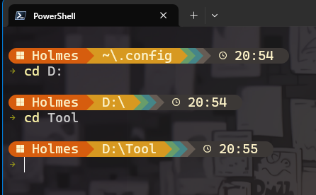

# Starship 配置

## 官网

https://starship.rs/zh-cn/

## 配置

- 路径：`~/.config/starship.toml`

- 命令

```Powershell
Invoke-WebRequest -Uri "https://raw.githubusercontent.com/HolmesZ/ConfigHub/refs/heads/main/starship/starship.toml" -OutFile "$env:USERPROFILE\.config\starship.toml"
```

- 主题参考：[gruvbox-rainbow-preset](https://starship.rs/zh-CN/presets/gruvbox-rainbow#gruvbox-rainbow-preset)

- 预览


